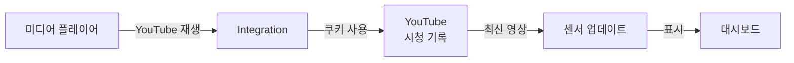

# YouTube Current Watching Integration

[![HACS][hacs-shield]](https://github.com/hacs/integration)

모바일 유튜브앱, Apple TV, Android TV, Google Nest, Fully Browser, HASS.Agent 등 **모든 미디어 플레이어**에서 YouTube 재생 시 자동으로 실제 시청 기록에서 정보를 가져오는 Home Assistant 통합 컴포넌트입니다.

[hacs-shield]: https://img.shields.io/badge/HACS-Custom-red.svg

---

## 스크린샷


<p align="center">
  
</p>
<p align="center">
  
  
</p>

---

## 주요 특징

- **모든 미디어 플레이어 지원** - Apple TV, Android TV, Google Nest Hub, Fully Kiosk, HASS.Agent 등
- **실제 YouTube 시청 기록 접근** - API 제한 없이 정확한 정보 제공
- **풍부한 정보 표시** - 썸네일, 제목, 채널, 동영상 길이 등
- **쿠키 기반 인증** - 간단하고 안정적인 설정
- **API 할당량 걱정 없음** - 무제한 접근 가능

### 왜 쿠키 방식인가?

YouTube Data API v3는 **실제 시청 기록 접근을 완벽하게 제공하지 않습니다**.

쿠키 방식의 장점:
- YouTube 시청 기록 페이지에 직접 접근
- 가장 최근 본 영상 정보를 정확하게 가져오기
- 좋아요 누르거나 특별한 작업 필요 없음
- API 할당량 제한 없음

---

## 설치 요구사항

- Home Assistant **2023.1** 이상
- 미디어 플레이어 통합 (Apple TV, Android TV, Chromecast 등)
- YouTube 계정 쿠키 파일

---

## 빠른 시작 가이드

5분 안에 YouTube Current Watching 통합을 설정할 수 있습니다.

### 단계 1: 쿠키 내보내기

#### Chrome 사용자 (권장)

1. **확장 프로그램 설치**
   - Chrome 웹 스토어에서 [Get cookies.txt LOCALLY](https://chrome.google.com/webstore/detail/get-cookiestxt-locally/cclelndahbckbenkjhflpdbgdldlbecc) 설치
   - 확장 프로그램 관리에서 "시크릿 모드에서 허용" 활성화

2. **시크릿 모드에서 YouTube 로그인**
   - 시크릿 창을 열고 [YouTube.com](https://youtube.com) 접속
   - YouTube 계정으로 로그인

3. **쿠키 내보내기**
   - 확장 프로그램 아이콘 클릭
   - "Export" 버튼 클릭
   - `youtube.com_cookies.txt` 파일 다운로드

4. **파일 이름 변경**
   ```
   youtube.com_cookies.txt → youtube_cookies.txt
   ```

#### Firefox 사용자

동일한 방식으로 "cookies.txt" 확장 프로그램을 사용하여 내보내기

---

### 단계 2: 쿠키 파일 업로드

Home Assistant의 `/config` 폴더에 `youtube_cookies.txt` 파일을 업로드합니다.

#### 방법 A: File Editor 애드온

1. Home Assistant에서 **File Editor** 애드온 열기
2. 좌측 폴더 아이콘 클릭
3. "Upload file" 선택 후 `youtube_cookies.txt` 업로드

#### 방법 B: Samba/SMB

```
Windows 탐색기에서 \\homeassistant\config 접속 후 파일 복사
```

#### 방법 C: SSH

```bash
scp youtube_cookies.txt root@homeassistant:/config/
```

#### 파일 위치 확인

```bash
ls -la /config/youtube_cookies.txt
```

다음과 같이 표시되어야 합니다:
```
-rw-r--r-- 1 root root 5234 Sep 30 12:34 /config/youtube_cookies.txt
```

---

### 단계 3: 통합 설치

#### 방법 A: HACS 사용 (권장)

1. **HACS** → **Integrations** → 우측 상단 메뉴 **(⋮)**
2. **Custom repositories** 선택
3. Repository 추가:
   ```
   https://github.com/redchupa/youtube_current_watching
   ```
   - Category: `Integration`
4. **YouTube Current Watching** 검색 후 다운로드
5. **Home Assistant 재시작**

#### 방법 B: 수동 설치

```bash
cd /config/custom_components
git clone https://github.com/redchupa/youtube_current_watching
```

설치 후 디렉토리 구조:
```
custom_components/
└── youtube_current_watching/
    ├── __init__.py
    ├── binary_sensor.py
    ├── config_flow.py
    ├── coordinator.py
    ├── const.py
    ├── manifest.json
    ├── sensor.py
    └── strings.json
```

**중요**: Home Assistant 재시작 필수

---

### 단계 4: 통합 설정

1. **설정** → **기기 및 서비스** → **통합 추가** 버튼 클릭
2. **"YouTube Current Watching"** 검색
3. 다음 정보 입력:
   - **미디어 플레이어**: YouTube를 시청하는 미디어 플레이어 선택
   - **쿠키 경로**: `/config/youtube_cookies.txt` (기본값)
   - **항상 추적 모드**: OFF (기본값, 필요시에만 ON)
4. **제출** 클릭

---

### 완료

다음 센서들이 자동으로 생성되었습니다:

- `sensor.youtube_current_watching` - 시청 정보
- `binary_sensor.youtube_cookies_status` - 쿠키 상태

#### 테스트하기

1. 미디어 플레이어에서 **YouTube 앱** 실행
2. 아무 영상 재생
3. Home Assistant → **개발자 도구** → **상태**
4. `sensor.youtube_current_watching` 검색
5. 영상 정보가 표시되는지 확인

---

## 생성되는 센서

### `sensor.youtube_current_watching`

현재 시청 중이거나 마지막으로 본 YouTube 영상 정보를 제공합니다.

| 항목 | 설명 |
|------|------|
| **State** | 영상 제목 |
| **Entity Picture** | 영상 썸네일 이미지 |

**Attributes**:

| Attribute | 설명 | 예시 |
|-----------|------|------|
| `channel` | 채널 이름 | "홍길동TV" |
| `title` | 영상 제목 | "Home Assistant 시작하기" |
| `video_id` | YouTube 비디오 ID | "dQw4w9WgXcQ" |
| `thumbnail` | 썸네일 URL | "https://..." |
| `duration` | 영상 길이 | "10:23" |
| `url` | YouTube 영상 링크 | "https://youtube.com/watch?v=..." |

### `binary_sensor.youtube_cookies_status`

YouTube 쿠키의 유효성 상태를 모니터링합니다.

| State | 의미 |
|-------|------|
| `on` (Connected) | 쿠키 유효 |
| `off` (Disconnected) | 쿠키 만료 또는 오류 |

---

## 대시보드에 추가하기

### Picture Entity 카드

```yaml
type: picture-entity
entity: sensor.youtube_current_watching
show_name: true
show_state: true
```

### 상세 정보 카드

```yaml
type: entities
title: 최근 시청한 YouTube
entities:
  - entity: sensor.youtube_current_watching
    name: 제목
  - type: attribute
    entity: sensor.youtube_current_watching
    attribute: channel
    name: 채널
  - type: attribute
    entity: sensor.youtube_current_watching
    attribute: duration
    name: 길이
  - type: attribute
    entity: sensor.youtube_current_watching
    attribute: url
    name: 링크
  - entity: binary_sensor.youtube_cookies_status
    name: 쿠키 상태
```

### Markdown 카드

```yaml
type: markdown
content: |
  ## 최근 시청
  
  **{{ state_attr('sensor.youtube_current_watching', 'title') }}**
  
  채널: {{ state_attr('sensor.youtube_current_watching', 'channel') }}
  
  길이: {{ state_attr('sensor.youtube_current_watching', 'duration') }}
  
  [YouTube에서 보기]({{ state_attr('sensor.youtube_current_watching', 'url') }})
```

---

## 작동 방식



**동작 과정**:

1. 미디어 플레이어에서 YouTube 재생 감지 (5가지 방법)
2. `media_title` 변경 감지
3. YouTube 시청 기록 페이지 스크래핑 (쿠키 인증 사용)
4. `ytInitialData` JSON 파싱
5. 센서 업데이트 (기본: 30초 간격, 재생 감지 시 즉시)

---

## 문제 해결

### 쿠키 상태가 OFF인 경우

**가능한 원인**:
- 쿠키 파일 경로 오류
- 쿠키 만료
- YouTube에서 로그아웃됨

**해결 방법**:

1. **쿠키 파일 확인**
   ```bash
   ls -la /config/youtube_cookies.txt
   ```

2. **쿠키 파일 교체**
   - YouTube에 다시 로그인 (시크릿 모드 권장)
   - 확장 프로그램으로 새 쿠키 내보내기
   - 기존 파일 덮어쓰기

3. **Home Assistant 재시작**

4. **로그 확인**
   - **설정** → **시스템** → **로그**
   - "youtube_current_watching" 검색

---

### 센서가 업데이트되지 않는 경우

**확인 사항**:
- 미디어 플레이어 통합이 활성화되어 있나요?
- 올바른 미디어 플레이어를 선택했나요?
- 미디어 플레이어의 `app_id`, `app_name`, `source` 속성이 존재하나요?

**디버깅 활성화**:

```yaml
# configuration.yaml에 추가
logger:
  default: info
  logs:
    custom_components.youtube_current_watching: debug
```

설정 후 Home Assistant 재시작

---

### 썸네일이 표시되지 않는 경우

일부 영상은 고해상도 썸네일(`maxresdefault`)이 없을 수 있습니다. 이 경우 자동으로 기본 해상도 썸네일로 폴백됩니다.

---

## 쿠키 보안

### 중요: 쿠키 파일 보호

쿠키는 **민감한 개인 정보**입니다. 다음 사항을 반드시 준수하세요:

#### 파일 권한 설정

```bash
# SSH 접속 후 실행
chmod 600 /config/youtube_cookies.txt
```

#### 보안 체크리스트

- 쿠키 파일을 공개 저장소(GitHub 등)에 업로드하지 않기
- `.gitignore`에 `youtube_cookies.txt` 추가하기
- 정기적으로 쿠키 갱신하기 (2-3개월마다)
- 의심스러운 활동 발견 시 즉시 YouTube 비밀번호 변경

---

## 자동화 예시

### YouTube 시청 시작 시 알림

```yaml
automation:
  - alias: "YouTube 시청 알림"
    trigger:
      - platform: state
        entity_id: sensor.youtube_current_watching
    condition:
      - condition: template
        value_template: "{{ trigger.from_state.state != trigger.to_state.state }}"
    action:
      - service: notify.mobile_app
        data:
          title: "YouTube 시청 중"
          message: >
            {{ state_attr('sensor.youtube_current_watching', 'title') }}
            by {{ state_attr('sensor.youtube_current_watching', 'channel') }}
```

### 쿠키 만료 시 알림

```yaml
automation:
  - alias: "YouTube 쿠키 만료 알림"
    trigger:
      - platform: state
        entity_id: binary_sensor.youtube_cookies_status
        to: "off"
        for:
          minutes: 5
    action:
      - service: persistent_notification.create
        data:
          title: "YouTube 쿠키 만료"
          message: >
            YouTube 쿠키가 만료되었습니다.
            새 쿠키 파일을 내보내주세요.
```

### 특정 채널 시청 시 조명 제어

```yaml
automation:
  - alias: "영화 채널 시청 시 조명 끄기"
    trigger:
      - platform: state
        entity_id: sensor.youtube_current_watching
    condition:
      - condition: template
        value_template: >
          {{ '영화' in state_attr('sensor.youtube_current_watching', 'channel') }}
    action:
      - service: light.turn_off
        target:
          entity_id: light.living_room
      - service: light.turn_on
        target:
          entity_id: light.ambient
        data:
          brightness: 50
```

---

## 기술 세부사항

### 시스템 요구사항

- **Home Assistant**: 2023.1 이상
- **Python**: 3.10 이상 (Home Assistant 내장)
- **필수 통합**: 미디어 플레이어 (Apple TV, Android TV, Chromecast 등)

### 의존성

Python 표준 라이브러리만 사용:
- `http.cookiejar.MozillaCookieJar` - 쿠키 파일 파싱
- `re` - 정규표현식 처리
- `json` - JSON 데이터 파싱
- `requests` - HTTP 요청

---

## FAQ

**Q: 쿠키는 얼마나 자주 갱신해야 하나요?**

A: 일반적으로 2-3개월마다 갱신하면 충분합니다. `binary_sensor.youtube_cookies_status`가 OFF로 변경되면 갱신이 필요합니다.

**Q: 여러 미디어 플레이어가 있으면 어떻게 하나요?**

A: 통합을 여러 번 추가하여 각 미디어 플레이어마다 별도로 설정할 수 있습니다. 각 통합은 독립적으로 작동합니다.

**Q: 쿠키가 계속 만료되는 이유는?**

A: YouTube 2단계 인증 또는 보안 설정을 확인하세요. 일부 계정은 더 자주 재인증이 필요할 수 있습니다. 또한 VPN 사용이나 IP 변경이 원인일 수 있습니다.

**Q: YouTube Data API를 사용하지 않는 이유는?**

A: YouTube Data API v3는 실제 시청 기록 접근을 제공하지 않습니다. 쿠키 방식이 가장 정확하고 제한 없는 방법입니다.

**Q: 항상 추적 모드는 언제 사용하나요?**

A: 일반적으로 필요하지 않습니다. 대부분의 기기에서 자동 감지가 잘 작동합니다. 특수한 경우에만 사용하세요.

---

## 지원되는 미디어 플레이어

- ✅ Apple TV
- ✅ Android TV / Google TV
- ✅ Google Nest Hub / Nest Hub Max
- ✅ Amazon Fire TV
- ✅ Chromecast
- ✅ Fully Kiosk Browser
- ✅ HASS.Agent (PC)
- ✅ 모바일 기기 (YouTube 앱)
- ✅ 기타 YouTube를 지원하는 모든 미디어 플레이어

---

## 기여하기

이슈와 풀 리퀘스트는 언제나 환영합니다.

### 버그 리포트

[이슈 작성하기](https://github.com/redchupa/youtube_current_watching/issues/new)

다음 정보를 포함해주세요:
- Home Assistant 버전
- 오류 로그
- 재현 방법

### 기능 제안

새로운 기능이나 개선 사항을 제안해주세요.

---

## 라이선스

MIT License

---

## 크레딧

원본 [AppDaemon YouTube Thumbnail](https://github.com/kkqq9320/Youtube-Thumbnail) 프로젝트를 참고하여 Home Assistant Integration으로 개발하였습니다.

---

## 후원하기

해당 HACS 컴포넌트가 도움이 되셨나요?

| TOSS로 기부하기 | Paypal로 기부하기 |
|----------------|------------------|
|  | <a href="https://www.paypal.com/ncp/payment/HG9KNC262PLAC"></a> |

---

**즐거운 스마트홈 되세요!**


