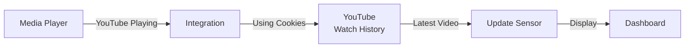

# YouTube Current Watching Integration

[![HACS][hacs-shield]](https://github.com/hacs/integration)

A Home Assistant integration that fetches information from your actual YouTube watch history when playing YouTube videos.

I developed this integration with the hope that children who watch a lot of YouTube videos using their parents' YouTube account can grow up properly.

Since you need to log in to your YouTube account and download cookie information, you must know the YouTube account password to use this component.

If your child does not share their Google account password with their parents, this component cannot be used.

Happy Smart Home!

\+ \(25/10/01\) Updated to show subscribed channel information upon request for additional features.
  I hope this helps with parenting.

\+ \(25/10/16\) I've updated the code to handle YouTube's recent switch from the videoRenderer format to lockupViewModel. I honestly didn't think I'd have to touch this again after the first time, but it looks like I'll need to release a new patch every time YouTube makes internal changes.

Lately, I don't have much free time to work on this, as I'd rather spend my evenings with my child. So, if YouTube breaks this patch again, please feel free to use the commented-out debugging code to fix it yourself.

That said, a donation might just free up some of my time... just saying 


[hacs-shield]: https://img.shields.io/badge/HACS-Custom-red.svg

---

## Screenshots

<p align="center">
  
</p>
<p align="center">
  
</p>
<p align="center">
  
  
</p>

---

## Key Features

- **All Media Players Supported** - Apple TV, Android TV, Google Nest Hub, Fully Kiosk, HASS.Agent, etc.
- **Real YouTube Watch History Access** - Accurate information without API limitations
- **Rich Information Display** - Thumbnails, titles, channels, video duration, etc.
- **Cookie-Based Authentication** - Simple and stable setup
- **No API Quota Worries** - Unlimited access

### Why Cookie-Based?

YouTube Data API v3 **does not provide complete access to actual watch history**.

Advantages of cookie-based approach:
- Direct access to YouTube watch history page
- Fetch most recently watched video information accurately
- No need to like videos or perform special actions
- No API quota limitations

---

## Requirements

- Home Assistant **2023.1** or higher
- Media Player integration (Apple TV, Android TV, Chromecast, etc.)
- YouTube account cookies file

---

## Quick Start Guide

You can set up YouTube Current Watching integration in 5 minutes.

### Step 1: Export Cookies

#### Chrome Users (Recommended)

1. **Install Extension**
   - Install [Get cookies.txt LOCALLY](https://chrome.google.com/webstore/detail/get-cookiestxt-locally/cclelndahbckbenkjhflpdbgdldlbecc) from Chrome Web Store
   - Enable "Allow in Incognito" in extension settings

2. **Login to YouTube in Incognito Mode**
   - Open incognito window and visit [YouTube.com](https://youtube.com)
   - Sign in with your YouTube account

3. **Export Cookies**
   - Click extension icon
   - Click "Export" button
   - Download `youtube.com_cookies.txt` file

4. **Rename File**
   ```
   cookies.txt → youtube_cookies.txt
   ```

#### Firefox Users

Use "cookies.txt" extension in the same way to export

---

### Step 2: Upload Cookies File

Upload `youtube_cookies.txt` file to Home Assistant's `/config` folder.

#### Method A: File Editor Add-on

1. Open **File Editor** add-on in Home Assistant
2. Click folder icon on the left
3. Select "Upload file" and upload `youtube_cookies.txt`

#### Method B: Samba/SMB

```
Access \\homeassistant\config in Windows Explorer and copy file
```

#### Method C: SSH

```bash
scp youtube_cookies.txt root@homeassistant:/config/
```

#### Verify File Location

```bash
ls -la /config/youtube_cookies.txt
```

Should display:
```
-rw-r--r-- 1 root root 5234 Sep 30 12:34 /config/youtube_cookies.txt
```

---

### Step 3: Install Integration

#### Method A: Using HACS (Recommended)

1. **HACS** → **Integrations** → Top-right menu **(⋮)**
2. Select **Custom repositories**
3. Add repository:
   ```
   https://github.com/redchupa/youtube_current_watching
   ```
   - Category: `Integration`
4. Search for **YouTube Current Watching** and download
5. **Restart Home Assistant**

#### Method B: Manual Installation

```bash
cd /config/custom_components
git clone https://github.com/redchupa/youtube_current_watching
```

Directory structure after installation:
```
custom_components/
└── youtube_current_watching/
    ├── __init__.py
    ├── binary_sensor.py
    ├── config_flow.py
    ├── coordinator.py
    ├── const.py
    ├── manifest.json
    ├── sensor.py
    └── strings.json
```

**Important**: Home Assistant restart required

---

### Step 4: Configure Integration

1. **Settings** → **Devices & Services** → Click **Add Integration** button
2. Search for **"YouTube Current Watching"**
3. Enter following information:
   - **Media Player**: Select media player for YouTube watching
   - **Cookies Path**: `/config/youtube_cookies.txt` (default)
   - **Track All Mode**: OFF (default, turn ON only when needed)
4. Click **Submit**

---

### Done!

Following sensors are automatically created:

- `sensor.youtube_current_watching` - Watch information
- `binary_sensor.youtube_cookies_status` - Cookie status

#### Test It

1. Launch **YouTube app** on media player
2. Play any video
3. Home Assistant → **Developer Tools** → **States**
4. Search for `sensor.youtube_current_watching`
5. Verify video information is displayed

---

## Created Sensors

### `sensor.youtube_current_watching`

Provides information about currently watching or last watched YouTube video.

| Item | Description |
|------|-------------|
| **State** | Video title |
| **Entity Picture** | Video thumbnail image |

**Attributes**:

| Attribute | Description | Example |
|-----------|-------------|---------|
| `channel` | Channel name | "Tech Channel" |
| `title` | Video title | "Getting Started with Home Assistant" |
| `video_id` | YouTube video ID | "dQw4w9WgXcQ" |
| `thumbnail` | Thumbnail URL | "https://..." |
| `duration` | Video length | "10:23" |
| `url` | YouTube video link | "https://youtube.com/watch?v=..." |

### `binary_sensor.youtube_cookies_status`

Monitors validity status of YouTube cookies.

| State | Meaning |
|-------|---------|
| `on` (Connected) | Cookies valid |
| `off` (Disconnected) | Cookies expired or error |

---

## Dashboard Examples

### Detailed Information Card Example

```yaml
type: entities
title: Recently Watched YouTube
entities:
  - entity: sensor.youtube_current_watching(your entity id)
    name: Title
  - type: attribute
    entity: sensor.youtube_current_watching(your entity id)
    attribute: channel
    name: Channel
  - type: attribute
    entity: sensor.youtube_current_watching(your entity id)
    attribute: duration
    name: Duration
  - type: attribute
    entity: sensor.youtube_current_watching(your entity id)
    attribute: url
    name: Link
  - entity: binary_sensor.youtube_cookies_status
    name: Cookie Status
```

### Button-Card Example

```yaml
type: custom:button-card
entity: sensor.youtube_watching
show_entity_picture: true
entity_picture: |
  [[[ return states['sensor.youtube_watching'].attributes.thumbnail ]]]
name: |
  [[[ return states['sensor.youtube_watching'].attributes.title ]]]
label: |
  [[[ return states['sensor.youtube_watching'].attributes.channel ]]]
show_label: true
tap_action:
  action: url
  url_path: |
    [[[ return states['sensor.youtube_watching'].attributes.url ]]]
```

---

## How It Works



**Process**:

1. Detect YouTube playback on media player (5 detection methods)
2. Detect `media_title` change
3. Scrape YouTube watch history page (using cookie authentication)
4. Parse `ytInitialData` JSON
5. Update sensor (default: 30-second interval, immediate on playback detection)

---

## Troubleshooting

### Cookie Status is OFF

**Possible Causes**:
- Cookie file path error
- Cookies expired
- Logged out from YouTube

**Solutions**:

1. **Check Cookie File**
   ```bash
   ls -la /config/youtube_cookies.txt
   ```

2. **Replace Cookie File**
   - Login to YouTube again (incognito mode recommended)
   - Export new cookies using extension
   - Overwrite existing file

3. **Restart Home Assistant**

4. **Check Logs**
   - **Settings** → **System** → **Logs**
   - Search for "youtube_current_watching"

---

### Sensor Not Updating

**Check**:
- Is media player integration activated?
- Did you select correct media player?
- Does media player have `app_id`, `app_name`, `source` attributes?

**Enable Debugging**:

```yaml
# Add to configuration.yaml
logger:
  default: info
  logs:
    custom_components.youtube_current_watching: debug
```

Restart Home Assistant after configuration

---

### Thumbnail Not Displaying

Some videos may not have high-resolution thumbnails (`maxresdefault`). In this case, it automatically falls back to default resolution thumbnail.

---

## Cookie Security

### Important: Protect Cookie File

Cookies are **sensitive personal information**. Please follow these guidelines:

#### File Permission Settings

```bash
# Run after SSH connection
chmod 600 /config/youtube_cookies.txt
```

#### Security Checklist

- Do not upload cookie file to public repositories (GitHub, etc.)
- Add `youtube_cookies.txt` to `.gitignore`
- Regularly renew cookies (every 2-3 months)
- Immediately change YouTube password if suspicious activity detected

---

## Automation Examples

### Notification on YouTube Playback Start

```yaml
automation:
  - alias: "YouTube Watching Notification"
    trigger:
      - platform: state
        entity_id: sensor.youtube_current_watching
    condition:
      - condition: template
        value_template: "{{ trigger.from_state.state != trigger.to_state.state }}"
    action:
      - service: notify.mobile_app
        data:
          title: "Watching YouTube"
          message: >
            {{ state_attr('sensor.youtube_current_watching', 'title') }}
            by {{ state_attr('sensor.youtube_current_watching', 'channel') }}
```

### Notification on Cookie Expiration

```yaml
automation:
  - alias: "YouTube Cookie Expiration Alert"
    trigger:
      - platform: state
        entity_id: binary_sensor.youtube_cookies_status
        to: "off"
        for:
          minutes: 5
    action:
      - service: persistent_notification.create
        data:
          title: "YouTube Cookies Expired"
          message: >
            YouTube cookies have expired.
            Please export new cookie file.
```

### Light Control When Watching Specific Channel

```yaml
automation:
  - alias: "Turn Off Lights When Watching Movies"
    trigger:
      - platform: state
        entity_id: sensor.youtube_current_watching
    condition:
      - condition: template
        value_template: >
          {{ 'Movies' in state_attr('sensor.youtube_current_watching', 'channel') }}
    action:
      - service: light.turn_off
        target:
          entity_id: light.living_room
      - service: light.turn_on
        target:
          entity_id: light.ambient
        data:
          brightness: 50
```

---

## Technical Details

### System Requirements

- **Home Assistant**: 2023.1 or higher
- **Python**: 3.10 or higher (built-in with Home Assistant)
- **Required Integration**: Media Player (Apple TV, Android TV, Chromecast, etc.)

### Dependencies

Uses only Python standard library:
- `http.cookiejar.MozillaCookieJar` - Cookie file parsing
- `re` - Regular expression processing
- `json` - JSON data parsing
- `requests` - HTTP requests

---

## FAQ

**Q: How often should I renew cookies?**

A: According to online research, they can be used for about 6 months. When `binary_sensor.youtube_cookies_status` turns OFF (disconnected), you need to download cookies again.

**Q: Why do cookies keep expiring?**

A: Check YouTube 2-step verification or security settings. Some accounts may require more frequent re-authentication. VPN usage or IP changes can also be the cause.

**Q: When should I use track_all (Always Track Mode)?**

A: Generally not needed. It works well on most media devices. Use it only with special media players in Home Assistant.

**Q: What happens when using a YouTube account shared by multiple family members?**

A: It will show the most recently watched video across all users.

---

## Supported Media Players

- Apple TV
- Android TV / Google TV
- Google Nest Hub / Nest Hub Max
- Amazon Fire TV
- Chromecast
- Fully Kiosk Browser
- HASS.Agent (PC)
- Mobile devices (YouTube app)
- Any other media player that supports YouTube

---

### Contributors and Referenced Projects

[KKQQ](https://github.com/kkqq9320/Youtube-Thumbnail)
[matt8707](https://github.com/matt8707/youtube-watching)
[claude.ai](https://claude.ai)

---

### Bug Reports

[Create Issue](https://github.com/redchupa/youtube_current_watching/issues/new)

Please include:
- Home Assistant version
- Error logs
- Steps to reproduce
- Suggest new features or improvements

---

## License

MIT License

---

## Support

If this HACS component has been helpful:

| Donate via TOSS | Donate via Paypal |
|-----------------|-------------------|
|  | <a href="https://www.paypal.com/ncp/payment/HG9KNC262PLAC"></a> |

---

**Happy Smart Home!**